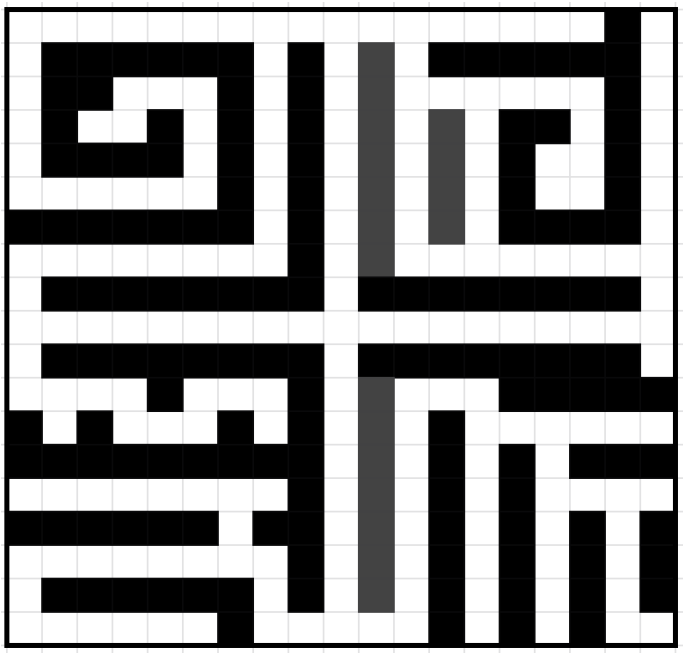
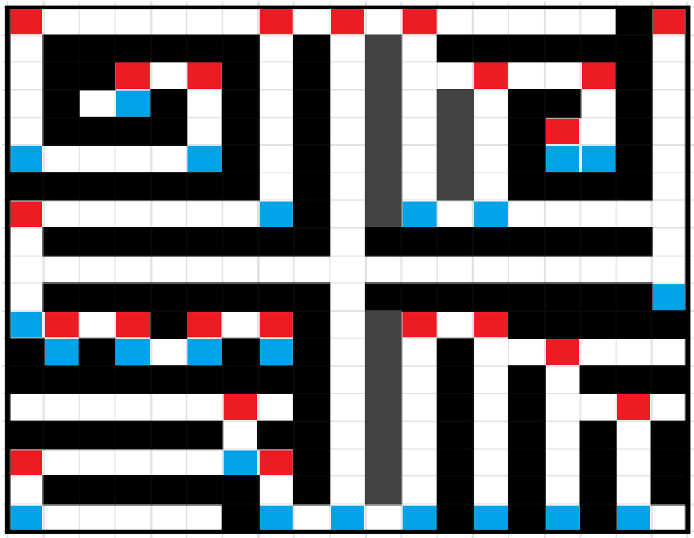

# ProbabilityProblem
The following is a fun probability problem to think about and solve:

You are given an initial grid design and connected to a drone located inside the schematic.

Example:

Although you are connected to the drone, you do not know exactly where your position is inside the schematic, nor do you get any feedback whatsoever when you command the drone to move. However, the drone will always attempt to move as you command if there is no wall in its path. As the drone operator, find a sequence of moves such that you can definitively say where the drone position is after a sequence of moves.

To provide some additional clarification, say you tell the drone to move down. After the move is processed, the possible position the drone can be located is shown in the picture below:

The red squares represent a 0% chance of the drone being there as the drone was previously commanded to move down. The white squares represent 1/(total possible positions) of the drone being there while the blue squares represent 2/(total possible positions) of the drone being there. 

As drones cannot move through the walls of the schematic, it is possible to "condense" possible drone locations together to devise a sequence of moves that guarantee a drone is at a certain location.

I have coded my solution to this problem in Java in the SchematicProblem folder and I encourage you to code a solution to this problem in a language of your choice. I find the problem particularly interesting and it would be fun to compete on whose program can find a shorter solution to a variety of grid designs.

Common Questions:
Q: Can the drone go out of bounds?
>The drone will not go past the boundary of the schematic. You can imagine a wall surrounding the rectangle/square input.

Q: What are valid grid inputs?
>As long as there is a path from any white square to any other white square in the design, it is valid. In other words, as long as the white squares are connected, you can design any wall pattern with the black squares. There are no limitations to the size of the design but please keep it as a rectangle or square as it is a grid probability problem. I used underscores to represent free space in my input design and X to represent a wall so please follow the design for your own reactors for convenience :D.

Q: Does the drone move on its own?
>The drone does not move unless commanded. Although it would be interesting to create a variation of this problem where the drone randomly moves after a certain number of moves.

Q: Where would our solutions go?
>You can post your solution to the problem and your custom reactor designs by creating a folder with yourGitHubName_SchematicProblem and uploading it to the repository or you can keep it for your own use. You can also include a readme file inside your folder to write how many moves your program took to pass any design.
